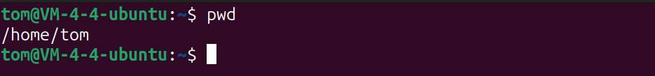
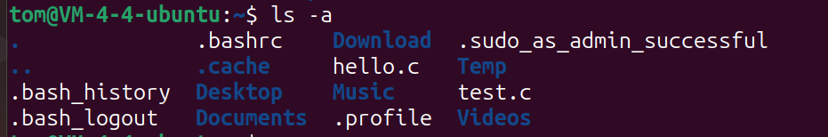
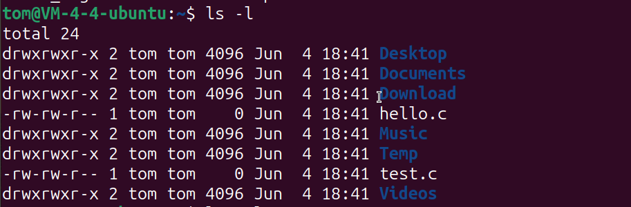
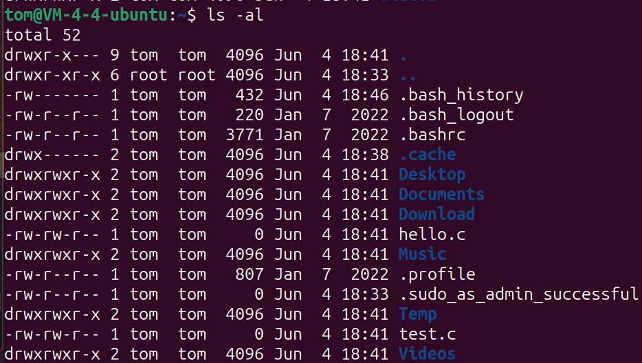

### 常用的Linux命令

#### `pwd`命令

作用：查看当前在哪个目录：

```bash
pwd
```

输出：



#### `ls`命令

作用：列出当前目录下的内容：

```bash
ls         # 列出文件夹下的内容
ls -a      # 列出文件夹下的内容，包括隐藏的文件
ls -l      # 列出文件夹下的内容，以列表的形式
ls -al     # 以列表形式，列出当前文件夹下的所有内容（包括隐藏文件）
```

测试`ls`命令：


加上参数`-a`：



加上参数`-l`



加上参数`-al`



#### 切换当前目录：`cd`命令

`cd`命令可以切换当前所在的目录，以在对应的目录中展开作业：

基本语法：

```bash
cd <目标目录>
```

例如，切换到`/opt`目录下

```bash
cd /opt
```

再使用`pwd`命令查看当前所在的目录，输出为`/opt`


`cd`的特殊用法：

直接在命令行中键入`cd`会直接切换到家目录

```bash
cd
```

如图：


#### 创建文件夹：`mkdir`命令

语法：

```bash
mkdir <目录名>           # 在当前目录下创建目录
mkdir <路径/目录名>      # 在指定路径下路下创建目录
```

例如，在当前目录下创建一个目录`NewDir`：

```bash
mkdir NewDir
```

结果为：


给指定的目录`/home/tom/Temp`下创建一个新目录`Test`


在一个不存在的目录(`/home/Projects`)下创建目录`Java`

```bash
mkdir -p /home/tom/Projects/Java
```

效果如下，该目录成功创建：


如果直接使用`mkdir`的话：

```bash
# `No such file or directory
mkdir /home/tom/Projects/Java
```

会被告知`No such file or directory`：


#### 引入相对路径的概念

绝对路径例如：

```bash
/home/tom/Temp/
```

相对路径：

```bash
./		# 在当前目录下
../		# 在当前目录的上一级
```

例如终端当前目录位于为`/home/tom`，则访问目录`/home/tom/Temp` 只需使用 `./Temp`即可，如：

```bash
ls ./Temp
```

输出：


或者，进入该目录：

```bash
cd ./Temp
```

查看当前目录及内容：


在`/home/tom/Temp`目录下我们返回父级目录，即`/home/tom/`目录下只需用`../`即可

```bash
cd ../
```

效果：


#### 创建文件：`touch`命令

语法：

```bash
touch <指定的文件>
```

例如：

```bash
touch Hello.Java
```

效果如下：


#### 复制（`cp`）命令：

cp命令的语法：

```bash
cp <要移动的文件> <要移动到的目标目录>
```

例如：

```bash
cp Hello.java ../	#将Hello.java文件复制到父目录
```


如果在复制目录的话，需要用到`-r`参数递归复制：

```bash
cp -r ./Projects ./Temp
```

效果如下，此时可以看见Temp目录下


不加 `-r`参数复制目录的操作会失败：

```bash
cp ./Projects ./Temp
```

结果：


#### 文件和文件夹的移动命令：`mv`

语法和`cp`命令很相似：

```bash
mv <文件/目录>	<目标目录>
```

例如移动`Hello.java`到`/home/tom`目录中（当前用户的家目录可以用`~`代替，与`/home/当前用户`的效果相同）：

```bash
mv Hello.java /home/tom
```

或者：

```bash
mv Hello.java ~
```

执行完这条命令后，发现`Hello.java`文件已经不在`Project`目录中了，而是在家目录中：


`mv`移动目录与文件同理：

例如将`tom`的家目录下的`Projects`目录移动到`Documents`目录中：

```bash
mv ./Projects ./Documents
```

通过`ls`命令来查看家目录下已经没有`Projects`这个目录了，在`Documents`目录下发现了它

